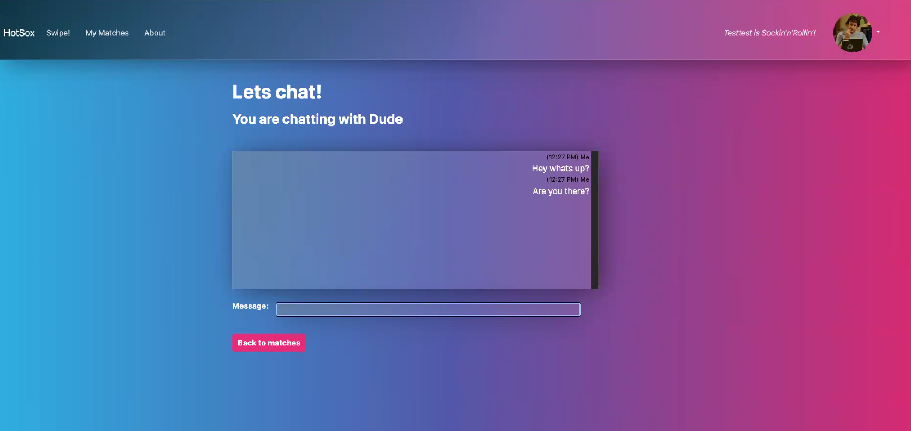

[Return to README.md](../README.md)

### MAIN FEATURE: Websocket based chat-module using “Django Channels“

 
Folder: [django/app_chat/]

The "app_chat" of the HotSox Project offers the Users of the application to interact and exchange text messages with their matches.
  

### Purpose

The purpose/ aim of the feature is to realize a realtime chat between two users of the hotsox app.
  

### Description

If one user sends a json encoded message using a websocket request to the backend, first it will be stored to the database. Secondly it will be resend from the backend to all subscribed listeners. In our case, this will include the sender itself as well as the “other” user that this message was actually meant for. A message has a string as payload content, a sending date and a seen date.
Once a message got “seen” in a frontend, it will be marked as seen and therefore stored with the “seen_date” in the database.
We have a Javascript Ajax function (websocket) waiting for a response (send message) from the backend. Once such a message got received the function will inject this message into a html _div_ to show this message to the user. It will also send this message to the backend again, to mark it as “seen”.
  

### Technical implementation

In the backend we use the websocket based library Django Channels [https://channels.readthedocs.io/en/stable/] in version 3.0.5. We decided to use version 3.0.5 because version 4.0 has some serious issues with the later versions of Uvicorn and Django. For our current MVP the version 3.0.5 fulfills all our needs.
Crucial to have websockets work is to run the whole Django project asynchronously. So we decided to switch from the standard WSGI server to the ASGI server. As deployment server we decided on Uvicorn as our production server [https://www.uvicorn.org].
Our frontend uses native Javascript and its build in websocket support. Alls the function calls are asynchronous as well.
  

### UI/UX

Our user experience should be as simple as possible for the moment. As MVP we decided to have a simple input box for max 160 chars and text box that represents the chat history for a max of the latest 300 messages.

  
