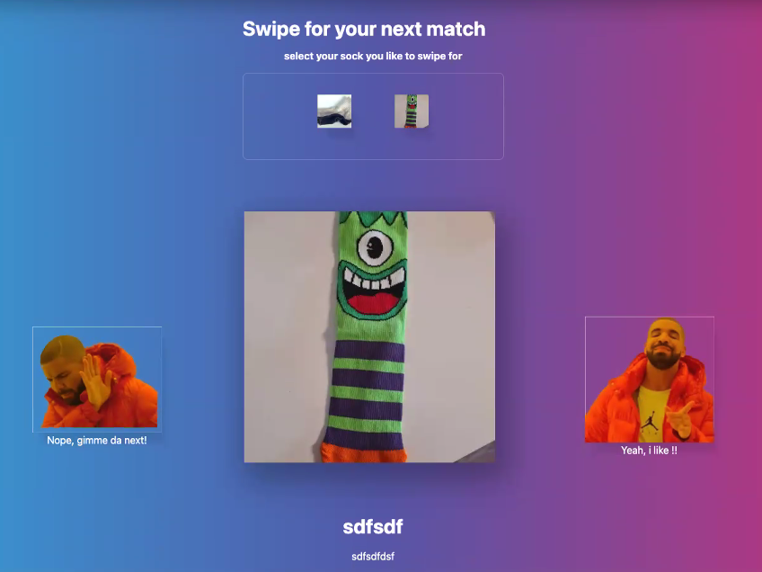

[Return to README.md](../README.md)

## Folder location
Folder: [django/app_home/]
  

### MAIN FEATURE: Swiping process
The "app_home" of the HotSox Project contains the main swiping functionality for a user to like or dislike a sock.
  

### Purpose and Description

The Swiping process is handles by the SwipeView which is a template view that handles the rendering and functionality of the swipe page where users swipe left or right on different socks to indicate whether they like or dislike them.
It uses the **pre-prediction algorithm** to suggest the next sock to swipe on.
Users can only swipe on socks they have not already swiped on. If a user likes another user's sock and the other user also likes the user's sock, a match is created and a notification email is sent to both users.
  

### Technical implementation

The **SwipeView class** is a subclass of _TemplateView_ and _HotSoxLogInAndValidationCheckMixin_, which ensures that only authenticated users have access to this view.
The uses as _model_ attribute the _User_ and as _*template_name*_ attribute, the template file name "**app_home/swipe.html**".

This class is composed of 2 main methods:

The <b>get()</b> method

It checks whether the user has selected a sock or not, and renders the pre-predicted sock on the screen. If the user has not selected a sock, it redirects them to the sock overview page. If the user has only one sock, it selects that sock automatically.

The **get()** method handles GET requests and shows the initial swipe view with a pre-predicted sock using the _*PrePredictionAlgorithm.get_next_sock()*_ method. It first checks if the user has a sock selected. If yes, it gets the pre-predicted sock and renders the template with the sock and the user's other socks. If not, it gets all the socks of the current user. If the user has only one sock, it selects that sock and redirects to the swipe page. If the user has more than one sock, it sets the redirect URL in the session and redirects to the sock overview page.

The <b>post()</b> method

It handles user interactions with the sock, allowing them to either like or dislike it. If a user likes a sock, it checks whether the sock they liked has also liked their sock, and if so, creates a match between the two users. If a user dislikes a sock, it simply records that they have disliked the sock and reloads the page with a new sock.

The **post()** method handles POST requests and is responsible for either liking or disliking a sock or changing the selected sock of the user. It first checks if the frontend wants to change the selected user sock. If yes, it sets the sock _PK_ in the session and redirects to the swipe page. If no, it gets the current user sock and the sock to be decided on and checks if the user liked or disliked the sock. If the user liked the sock and the other user also liked the user's sock, it creates a match in the _UserMatch_ table using the _UserMatch.objects.create()_ method. It also sends a notification email to both users using the _celery_send_mail.delay()_ method and renders the template with the matched sock details. It also adds navigation arrows to the template.

### Swiping Process Flowchart

  

### UX/UI

The generic overview of the UI for HotSox application is as follows:
  

   

### MAIN FEATURE: Pre-Prediction Algorithm
The "app_home" of the HotSox Project contains the pre_prediction algorithm that handles the match preselection between User/Socks profiles.
  

### Purpose

The purpose of the 'Pre-Prediction Algorithm' is to predict the next sock that a user might like based on the similarity score calculated from their previous sock preferences.
  

### Description

The algorithm calculates a similarity score between two socks and then filters out the socks which have already been liked or disliked by the user, as well as the user's own socks. The remaining unseen socks are then sorted in decreasing order of similarity to the user's current sock, and the most similar sock is returned as the next suggested sock match.
  

### Technical implementation of the features

The **PrePredictionAlgorithm** class contains several static methods used to perform different parts of the pre-prediction algorithm.

The **\_compare_socks** method calculates a similarity score between two socks. The socks are compared based on various attributes such as color, size, type, fabric, condition, holes, age, fabric thickness, kilometers, indoor/outdoor usage, washed status, brand, joining date, separation date, special notes and about notes. Each attribute is assigned a weightage, which is used to calculate the final similarity score for the two socks.
The **\_prefilter_list_of_all_socks** method filters out the socks which have already been liked or disliked by the user, as well as the user's own socks. It also excludes the socks of any users with whom the current user has been matched before and any user that has now been unmatched, and any socks without pictures.

The **get_next_sock** method is the main method of the pre-prediction algorithm.

It first calls the **\_prefilter_list_of_all_socks** method to get the list of remaining unseen socks. It then calculates the similarity score between the current user's sock and each of the remaining socks using the **\_compare_socks** method, and sorts the socks in decreasing order of similarity. Finally, it returns the sock with the highest similarity score as the next suggested sock to match with. If there are no remaining unseen socks, it returns None.
The code imports several modules such as Q, User, Sock, SockLike, UserMatch, random, datetime, timedelta, and SequenceMatcher.
The Q object is used for complex queries, and the SequenceMatcher is used to calculate the similarity ratio between the text attributes of the socks.
