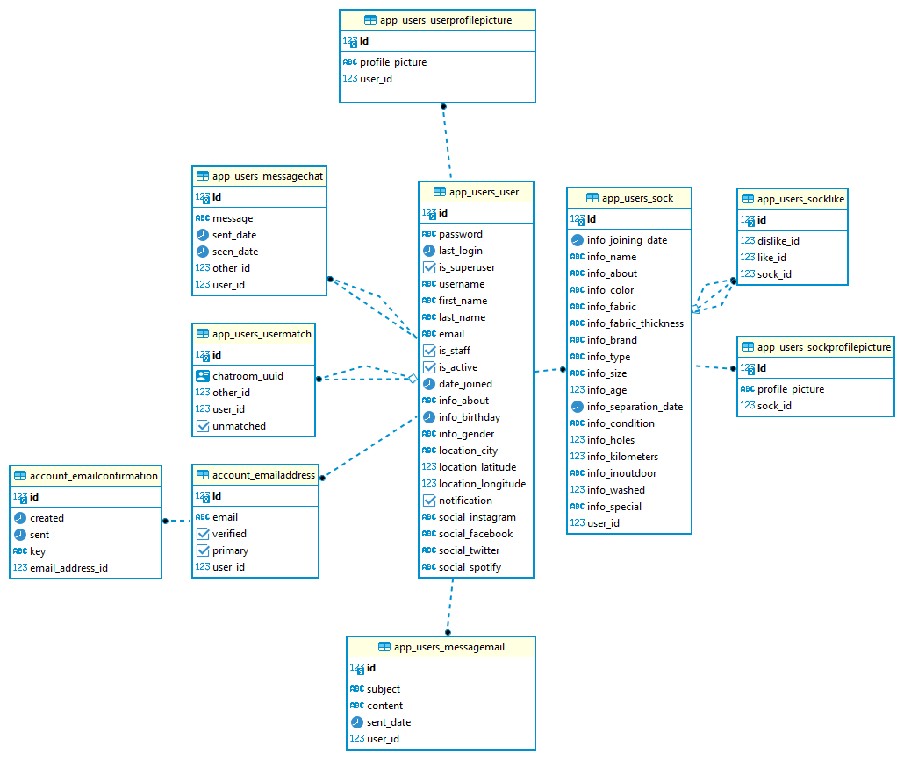
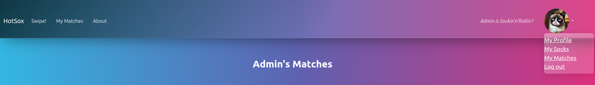
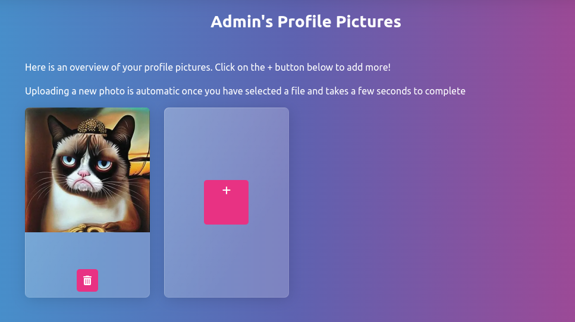
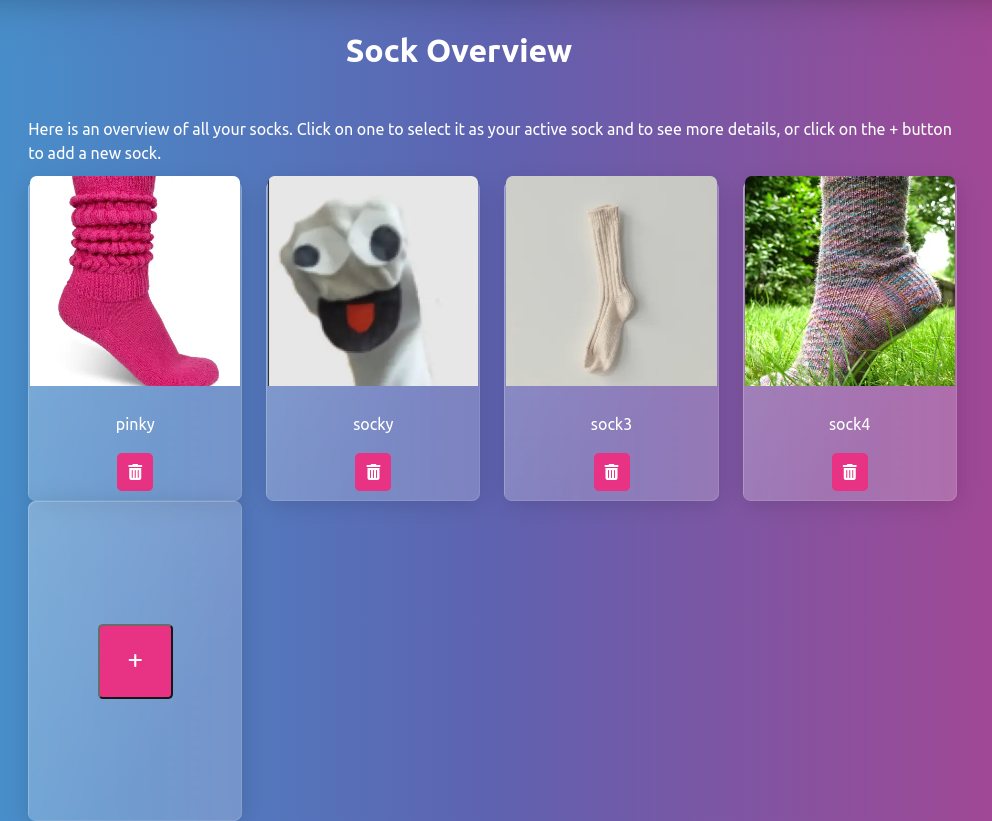
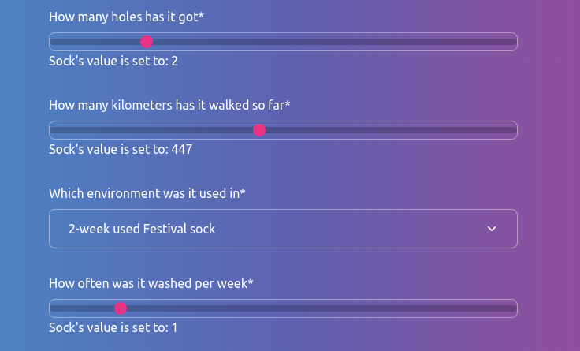

[Return to README.md](../README.md)

## Folder location
Folder: [django/app_users/]
<br/><br/>

### MAIN FEATURE: Login and User CRUD using “Django AllAuth”

The "app_user" of the HotSox Project is composed by different features that handles the User Profiles and their related Socks profile/s.
<br/><br/>

### Purpose

The purpose/ aim of the feature is to give the user the option to register and/or sign in/out (or edit) preferences with the app alonside to create edit and manage socks profile information.
<br/><br/>

### Description

A user can signup to the app by entering his personal information and attributes from username, password to age and city where the user lives in.
During this signup process we lookup the geolocation (see geo_app documentation for details) from the given city name. Everything will be stored to our database as the main user model.
Using AllAuth we do not have to create the whole authentication process but relay on what is done by this package.
A user can upload one or many profile picture/s which will be stored to the cloudinary CDN service. We use their python SDK packet to make it most convenient for our development experience [https://cloudinary.com/documentation/python_quickstart]. This SDK includes a Django ready model field as a specific “picture upload field”.
Users can edit their profiles as well as add or remove pics from their profile pictures.

A user can see a profile overview that shows all his/her personal data as well as a visual representation of his geo location on a map created by folium. As a part of this overview a user is also able to delete his/her account. An account deletion will also delete any related data (socks, pictures, messages, chats) from the database.

A user can create an account at hotsox using the social media login via Oatuth2.0 via google. He/she needs to have a valid account at google. Validation and password hashing is done by google automatically.
<br/><br/>

### Technical implementation

The whole app is designed around the logged-in user. Every aspect of the app, every functionality, every backend or frontend part is validating that a given user has the permission to do a certain action. A logged in user can only see him-/herself, its own socks, and all actions that has him/her as the center of interest. A user can only interact with another user once they have a valid match. This means you can only see, chat, interact with a users you matched.
This is done using custom validation mixing classes that inherit their main functionality from Djangos “LoginRequiredMixin” class. Every view or endpoint is protected, except the signup and login.
<br/><br/>

### UI/UX:

Our frontend uses custom forms for signup / login / and log out. The forms are designed using crispy forms as well as custom form widgets. The widgets are a custom switch to enable/ disable notifications, and sliding range selectors for any numeric input field.
<br/><br/>

### Licenses & Dependencies

Django AllAuth https://django-allauth.readthedocs.io/en/latest/
Django crispy forms https://django-crispy-forms.readthedocs.io/en/latest/
Cloudinary SDK https://cloudinary.com/documentation/python_quickstart/
<br/><br/><br/>

### MAIN FEATURE: Database/Models

All the data models are defined in the models.py file. Django is responsible for migrating the database.
<br/><br/>

### Description of feature:

The HotSox database model is based on a relational SQL Database (Postgres) that stores information about Users, Socks, Matches and Messages.
<br/><br/>

### Technical implementation:

This dating app is not an ordinary platform, and you can clearly see that from our database. We aimed to depart from the idea of providing everything to the user at once. Our unique "sock" plays a significant role in the app, and in order to connect with another user, one must first rummage through socks - sometimes clean, sometimes not very clean, and sometimes even smelly.
<br/><br/>

### ERD of the relevant tables of our Database:



According to our diagram, both users must create a profile for their socks and like each other's socks in order to chat. In programming terms, this means that users need to create a “Sock” object and a “User” object, followed by a “SockLike” object that links the two. Once both users have liked each other's socks, they can create a “UserMatch” object to indicate that they are a match. Then, they can start exchanging messages using the “MessageChat” object. The “SockProfilePicture” object can be used to upload and display profile pictures for socks, while the “UserProfilePicture” object can be used for users. All of these objects are stored in the HotSox Database, a relational database implemented using the Django web framework and supported by a PostgreSQL database.

For example: code block user_app/models.py/lines33-68:

```python
class User(AbstractUser):
    email = models.EmailField(_("email address"), blank=True, unique=True)
    info_about = models.TextField(blank=True)
    info_birthday = models.DateField(default=timezone.now, blank=False)
    info_gender = models.CharField(max_length=10, choices=GENDER_CHOICES, blank=False)
    ....
```

This is a Django model class called “User” which inherits from Django's built-in “AbstractUser” model.
In addition to the fields inherited from “AbstractUser” we included customs fields to give the user more information.
The User model is used as ForeignKey in other models.

e.g.: the “UserMatch” Model codeblock: user_app/models.py/lines207-235

```python
class UserMatch(models.Model):
    user = models.ForeignKey(
        User,
        related_name="user_match",
        on_delete=models.CASCADE,
        blank=True,
        null=True,
    )
    other = models.ForeignKey(
        User,
        related_name="matched",
        on_delete=models.CASCADE,
        blank=True,
        null=True,
    )
    ....

```

The "user" and "other" fields are foreign keys to the" User" model, representing the users who are matched. The "related_name" parameter is used to set the reverse relation names on the" User" model. The "unmatched" field is a boolean that is set to "True" when the match is no longer valid. The "chatroom_uuid" field is a UUID (Universally Unique Identifier) that is used to identify the chatroom where the matched users can communicate.
<br/><br/>

#### Dependency:

Cloudinary (https://cloudinary.com/documentation)
<br/><br/>

### Getter methods of the models for easier access of ORM queries

#### Description of feature:

The getter methods sets of functions defined in the User and Sock classes that are used to retrieve specific information from a user or sock instance. These methods include **get_all_pictures**, **get_picture_urls**, **get_matches**, **get_unmatched**, **get_socks**, **get_mail_messages**, and **get_chat_messages** for the User model. The Sock besides **get_all_pictures** and **get_picture_urls** has its own **get_likes** and **get_dislikes** methods. See Metod Details section below for further info.
<br/><br/>

#### Purpose:

The purpose of these methods is to provide an easy way to retrieve specific information about a user or sock instance, without having to manually access the database.
<br/><br/>

#### Technical Implementation:

These methods are implemented using Django's QuerySet API, which provides a simple way to query the database for specific objects. Each method retrieves the relevant objects using one or more queries and returns them as a queryset or list, depending on the use case.
<br/><br/>

#### Django Authentification Model

The User Model inherit from the AbstractUser class, which is part of Django's built-in authentication system.
<br/><br/>

#### User Model Method Details:

> <details><summary><b>get_all_pictures</b></summary> Returns a queryset containing all profile pictures associated with the user instance.</details>
> <details><summary><b>get_picture_urls</b></summary> Returns a list of URLs for all profile pictures associated with the user instance.</details>
> <details><summary><b>get_matches</b></summary> Returns a queryset containing all matches associated with the user instance.</details>
> <details><summary><b>get_unmatched</b></summary> Returns a queryset containing all unmatched matches associated with the user instance.</details>
> <details><summary><b>get_socks</b></summary> Returns a queryset containing all socks associated with the user instance.</details>
> <details><summary><b>get_mail_messages</b></summary> Returns a queryset containing all mail messages associated with the user instance.</details>
> <details><summary><b>get_chat_messages</b></summary> Returns a queryset containing all chat messages associated with the user instance.</details>
<br/><br/>

#### Sock Model Method Details:

> <details><summary><b>get_all_pictures</b></summary> Returns a queryset containing all profile pictures associated with the sock instance.</details>
> <details><summary><b>get_picture_urls</b></summary> Returns a list of URLs for all profile pictures associated with the sock instance.</details>
> <details><summary><b>get_likes</b></summary> Returns a queryset of Sock instances liked by the current Sock instance.</details>
> <details><summary><b>get_dislikes</b></summary> Returns a queryset of Sock instances that the current Sock instance has disliked.</details>
<br/><br/>

## MAIN FEATURE: Forms/Templates and Validation

### Description

Django templates and forms provide a basic front-end user interface through which the user can access and manipulate the data stored in the HotSox database.
<br/><br/>

### Purpose

To allow users to intuitively navigate through the site and interact with the database through CRUD (create, retrieve, update and delete) operations.
<br/><br/>

### Technical Implementation

#### **Templates**

The templates use regular HTML with django templating language to insert variables from the backend to the frontend. Data is provided to Django templates through the context send by the associated views.py file.
<br/><br/>

#### **Base.html**

A `base.html` file in the `templates` folder in the root django folder (alongside `manage.py`) contains the structure and styles used on every page of the website. All other pages extend the `base.html`

Features of base.html include:
• cookie consent form
• bootswatch theme and general css import
• navigation bar (rendered according to login state of user)
• Django messages banner (for displaying success/error messages to user)
• Fontawesome import
• Jquery import
• Bootstrap 5 popper and javascript imports
• designated positions for block title and block content
<br/><br/>

#### **Extended base.html**

A secondary “base” template called `user_base.html` was created for pages with navigational arrows present. As many (but not all) pages contain these arrows, this template extends the original `base.html` and can be further extended by any pages that use the navigational arrows.
<br/><br/>

#### **Bootstrap**

Bootstrap 5 was used for this project to provide a simple and consistent layout for the user interface. This was imported in the form of a Bootswatch theme, with the css saved locally.
<br/><br/>

#### **Navbar**

The navbar provides a simple interface for users to sign up, log in and navigate around the site.
The navbar element is a standard bootstrap navbar with the addition of the user’s profile picture which holds a dropdown menu with links to the logged in user’s profile, socks and matches. We have included custom CSS to give the navbar a “glassy” appearance which complements the “Quartz” bootswatch theme.


<br/><br/>

#### **Cards**

Standard Bootstrap cards were utilised throughout the site to provide simple and clean separation of pictures, socks and matches.




<br/><br/>

#### **Forms**

Forms were created in an associated `forms.py` file. For user related forms, the built in `UserCreationForm` and `UserChangeForm` from `django.contrib.auth.forms` were imported and inherited from. Other forms inherit from the `Modelform` imported from `django.forms`. The `Meta` class in each form class designate the model used and which fields form this model are displayed in the form. Where used, custom labels and widgets are also defined within the `Meta`class.
Forms use a GET request for rendering the form and a POST request for submitting the form. Each form is secured with a csrf_token.
<br/><br/>

#### **Form validation**

Any user related forms have three associated validation functions to ensure any user entered data complies to our desired criteria. This includes username and email validation to ensure each submitted username and validation are not already in use (except by the logged in user in the case of profile edit). There is also an age validation which calculates the age of the user based on their birth date and checks whether they are over 18. If so, the user may proceed, if not, the user must enter a different birth date or exit the site.
<br/><br/>

#### **Crispy Forms**

Forms are implemented into Django templates using “crispy forms” with Django templating language syntax, for example:
`{{ form_user_profile|crispy }}`
Crispy forms improve the user interface by rendering forms which are sleeker and more visually appealing.
<br/><br/>

#### **Widgets**

We use two custom widgets to improve the user interface of the forms we use. These use imported classes from `django.forms.widgets`:
Range input
The range input sliders allow the user to drag the slider to select their desired value, rather than entering a number. This is more visually appealing and user friendly than the default number entry form field. Based on the `NumberInput` from `django.forms.widgets`.


<br/><br/>

#### **Switch checkbox input**

A custom switch checkbox widget replaces the default checkbox for a more visually appealing and interactive slider style switch. Based on the `CheckboxInput` from `django.forms.widgets`.


<br/><br/>

### UI/UX

Our user interface aims to be simple and user friendly whilst maintaining some character with the Bootswatch “Quartz” theme. We use Crispy forms and custom widgets to optimise the form aspect of our UI to improve user experience.
<br/><br/>

### Dependencies

Crispy forms:
```
django-crispy-forms==1.14.0
crispy-bootstrap5==0.7
```
<br/>

### Licenses

- Django crispy forms (https://django-crispy-forms.readthedocs.io/en/latest/)
- Bootstrap 5 (https://getbootstrap.com/docs/5.3/getting-started/introduction/)
- Bootswatch “Quartz” Theme (https://bootswatch.com/quartz/)

<br/>

### MAIN FEATURE: Match Overview [^1]

[^1] NOTE: Peer will take care
